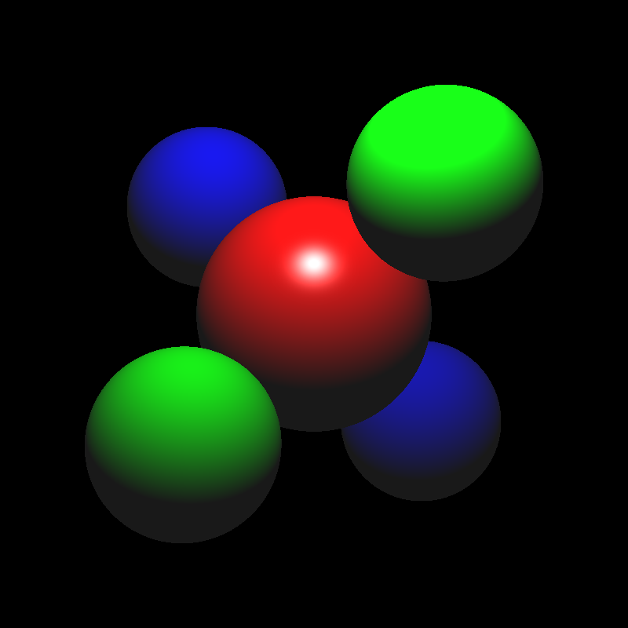
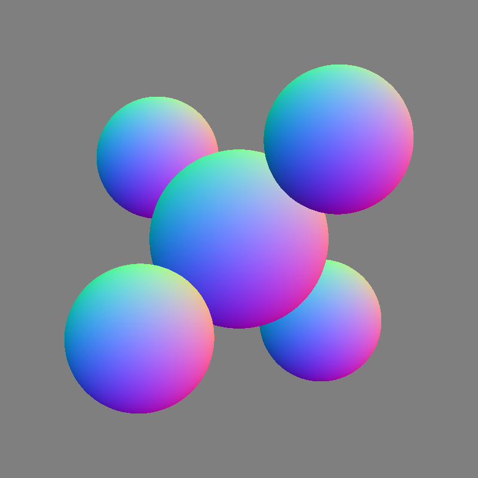

## 光照模型与光线追踪

### 1. Phong光照模型
#### 1.1 实验结果
<table>
    <tr>
        <td>

            
        
</td>
        <td>

            
        </td>
        <td>

            
        
</td>
    </tr>
</table>

#### 1.2 实现方式

**获取光照强度**
通过计算交点和光源的距离，使用下面的公式计算交点的光照强度。
$$
I(x_{surf})=\frac{I}{\alpha d^2}
$$
其中，$I$ 是光源的光照强度，$\alpha$ 是光源的衰减系数，$d$ 是交点和光源的距离。

**漫反射着色器**
使用下面的公式计算漫反射的光照强度。
$$
I_{diffuse}=k_{diffuse}* I_{light} * clamp(L, N)
$$

$$
clamp(L, N)=max(0, L \cdot N)
$$

其中，$k_{diffuse}$ 是漫反射系数，$I_{light}$ 是光源的光照强度，$L$ 是光源的光照方向，$N$ 是交点的法向量。

**镜面反射着色器**
使用下面的公式计算镜面反射的光照强度。
$$
I_{specular}=k_{specular}* I_{light} * clamp(R, V)^{s}
$$
其中，$k_{specular}$ 是镜面反射系数，$I_{light}$ 是光源的光照强度，$R$ 是反射方向，$V$ 是视线方向，$s$ 是光泽度。

反射方向$R$ 是通过入射方向$E$ 和法向量$N$ 计算得到。
$$
R=E-2(N \cdot E)N
$$

**环境光着色器**
使用下面的公式计算环境光的光照强度。
$$
I_{ambient}=k_{diffuse}* I_{ambient}
$$
其中，$k_{diffuse}$ 是漫反射系数，$I_{ambient}$ 是光源的光照强度。

**Phong光照模型**
遍历所有的光源，将漫反射和镜面反射的光照强度相加，然后在把环境光的光照强度相加，得到最终的光照强度。
$$
I_{phong}=I_{ambient}+ \sum_{i \in lights} (I_{specular, i}+I_{diffuse, i})
$$

### 2. 光线投射
#### 2.1 平面
**实验结果**
<table>
    <tr>
        <td>

            
        
</td>
        <td>

            
        
</td>
        <td>

            
        
</td>
    </tr>
</table>

**实现方式**
使用$P \cdot n=d$表示平面，$P$ 是平面上的点，$n$ 是平面的法向量，$d$ 是平面到原点的距离。使用$O+tD$表示光线，$O$ 是光线的起点，$D$ 是光线的方向，$t$ 是交点相对光线的起点距离。使用下面的公式计算交点。
$$
t=\frac{d-O \cdot n}{D \cdot n}
$$
然后判断交点是否在光源之后，即$t>t_{min}$。然后判断是否在光线已有交点之前。若满足上述条件，则更新交点。

#### 2.2 三角形
**实验结果**
<table>
    <tr>
        <td>

            
        
</td>
        <td>

            
        
</td>
        <td>

            
        
</td>
    </tr>
</table>

**实现方式**
使用Möller–Trumbore算法计算三角形和光线的交点。首先用三角形三个顶点表示交点P。
$$
P=(1-u-v)A+uB+vC
$$
代入光线方程$O+tD$，得到
$$
O+tD=(1-u-v)A+uB+vC
$$
整理得到
$$
\begin{bmatrix}
    -D & (B - A) & (C - A) 
\end{bmatrix}
\begin{bmatrix}
    t \\
    u \\
    v \\
\end{bmatrix}
=O-A
$$
通过$u$, $v$, 得到$1-u-v$的值，判断三者是否都在$[0, 1]$之间。然后判断$t$是否在$[t_{min}, t_{exist}]$之间。若满足上述条件，则更新交点。

#### 2.3 变换类
**实验结果**
<table>
    <tr>
        <td>

            
        
</td>
        <td>

            
        
</td>
        <td>

            
        
</td>
    </tr>
    <tr>
        <td>

            
        
</td>
        <td>

            
        
</td>
        <td>

            
        
</td>
    </tr>
    <tr>
        <td>

            
        
</td>
        <td>

            
        
</td>
        <td>

            
        
</td>
</table>

**实现方式**
存储一个变换矩阵$M$，及其逆变换矩阵$M^{-1}$，使用下面的公式将光源从世界坐标系变换到物体坐标系。
$$
O_{object}=M^{-1}[O_{world}, 1]
$$
$$
D_{object}=M^{-1}[D_{world}, 0]
$$

调用对象的intersect函数，判断交点。得到交点之后，将交点的法向量从局部坐标系变换到世界坐标系，使用下面的变换公式。
$$
N_{world}=(M^{-1})^TN_{object}
$$

